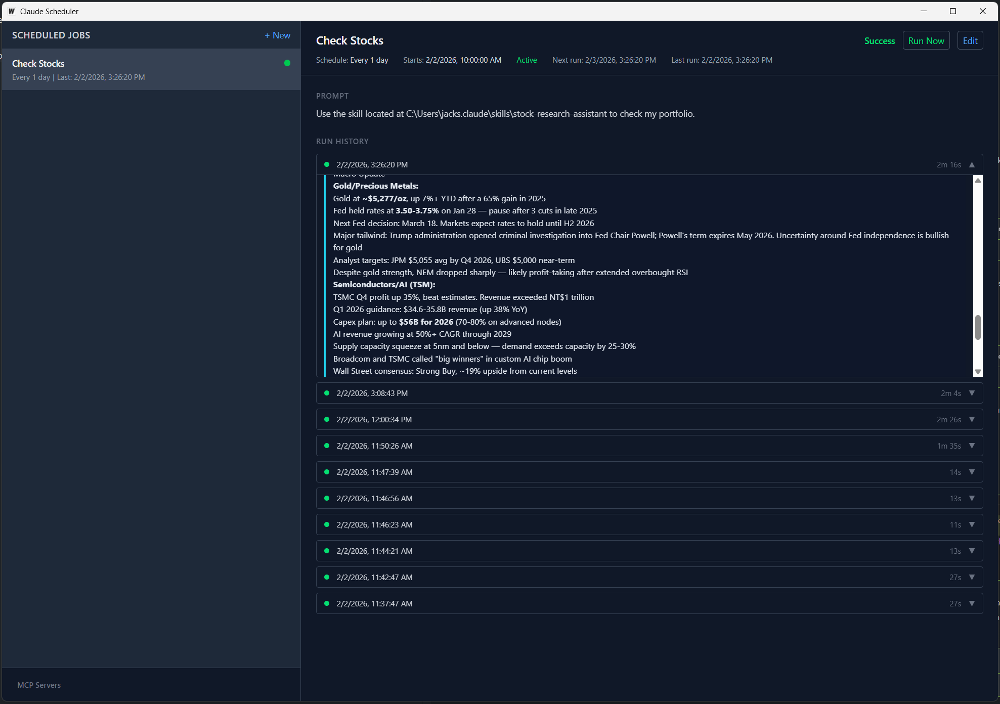
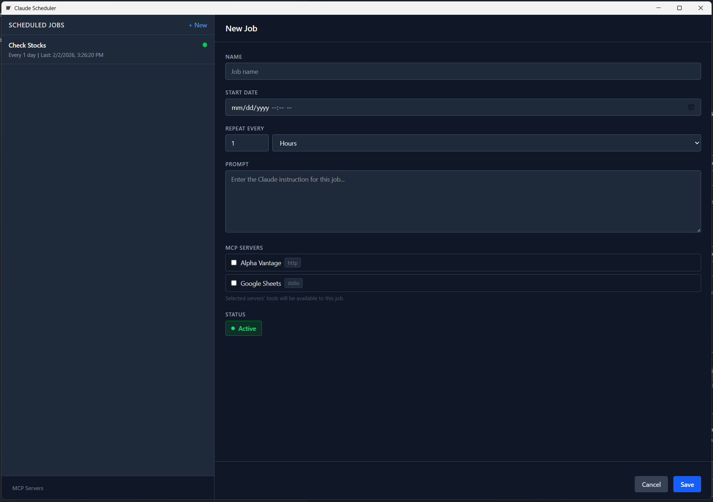
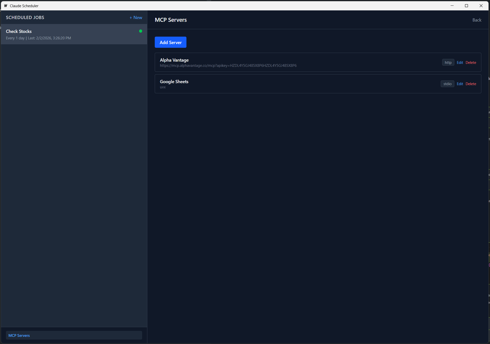

# Claude Scheduler

Claude Scheduler is a cross-platform desktop application for scheduling tasks that run using
[Claude Code](https://docs.anthropic.com/en/docs/claude-code). Configure prompts to execute on
a repeating schedule, attach MCP servers for external tool access, and review rich run history
with collapsible tool-call transcripts -- all from a single native UI.

## Features

- **Scheduled prompts** -- set a start time and repeat interval (minutes, hours, or days) and Claude Scheduler runs your prompt automatically.
- **Run Now** -- trigger any job immediately without waiting for the next scheduled time.
- **MCP server management** -- add HTTP or stdio MCP servers globally, then selectively assign them to individual jobs.
- **Rich run output** -- each run records a full transcript with colour-coded thoughts, collapsible tool calls, and a summary section.
- **Markdown prompts** -- write prompts in Markdown; they render inline in the job detail view.
- **Background operation** -- runs in the system tray with native OS notifications on job completion or failure.
- **Cross-platform** -- builds for Linux, Windows, and macOS.

## Screenshots

### Creating a new job

Configure a name, schedule, prompt (Markdown supported), and optionally assign MCP servers whose
tools should be available during execution.

### Managing MCP servers

Add HTTP or stdio-based MCP servers. Each server can then be assigned to one or more jobs.

## Download

Pre-built binaries for each release are available on the
[GitHub Releases](https://github.com/nicholasjackson/claude-schedule/releases) page.

| Platform | Artifact |
|----------|----------|
| Linux (amd64) | `claude-schedule-linux-amd64` |
| Windows (amd64) | `claude-schedule-windows-amd64.exe` |
| macOS (amd64) | `claude-schedule-darwin-amd64.zip` |

- **Linux** -- download, `chmod +x claude-schedule-linux-amd64`, and run.
- **Windows** -- download and run the `.exe`.
- **macOS** -- unzip to get `claude-schedule.app`, move it to `/Applications`, and double-click to launch.

## Prerequisites

Claude Scheduler requires [Claude Code](https://docs.anthropic.com/en/docs/claude-code) to be
installed and authenticated. Make sure `claude` is available on your `PATH` and that you have
logged in (`claude /login`).

## Building from source

### Requirements

- Go 1.24+
- Node.js 18+
- Wails CLI v3: `go install github.com/wailsapp/wails/v3/cmd/wails3@latest`
- Task runner: `go install github.com/go-task/task/v3/cmd/task@latest`
- Linux only: `sudo apt-get install build-essential libgtk-3-dev libwebkit2gtk-4.1-dev libsoup-3.0-dev`

### Build commands

| Command | Description |
|---------|-------------|
| `make dev` | Run with live reload (Wails dev mode) |
| `make build` | Build production binary to `build/bin/` |
| `make test` | Run all tests (Go + frontend) |
| `make lint` | Run all linters (Go + frontend) |
| `make generate` | Generate Wails JS/TS bindings |
| `make clean` | Remove build artifacts |

## License

See [LICENSE](LICENSE) for details.
